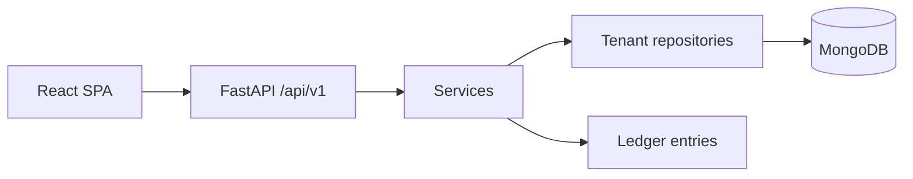

# Architecture

Modular monolith: React (Vite) frontend, FastAPI backend, MongoDB.

## Multi-tenancy

Tenant identity comes from the JWT, never from the client body. Every tenant collection query includes `tenant_id`.

Platform super admins have no tenant data access unless they mint an audited support token.

## Finance

Balances are computed from `ledger_entries` (debit/credit). Collections, expenses, advances, fuel, and 3PL post ledger rows. Voiding is used instead of deleting financial rows.

## Trip lifecycle

`draft → new → assigned → started → in_transit → delivered → completed → closed` with `cancelled` from most open states.

## Storage / notifications / integrations

File metadata is tenant-scoped. Object storage, SMS, WhatsApp, GPS, and GST adapters are intentionally not hard-wired; environment placeholders exist.

## Coverage vs product spec

Implemented as a modular monolith with tenant-scoped repositories and ledger finance.

**In this release:** platform admin, tenant settings, locations/routes, vehicle listing/models/documents/maintenance (not a full tyre/spare warehouse), drivers/employees/advances, parties + autocomplete + ledger, indoor/outdoor trips, LR print/templates, fuel + 3PL ledgers, expenses, collections/handover, owner & Deewanji dashboards, reports CSV/Excel, notifications, PWA, Docker, isolation tests.

**Deferred / adapters only:** GPS, FASTag, WhatsApp/SMS senders, billing provider, AI, customer portal, tyre/spare stock ledgers. Storage is local-disk with a swap-ready interface.

